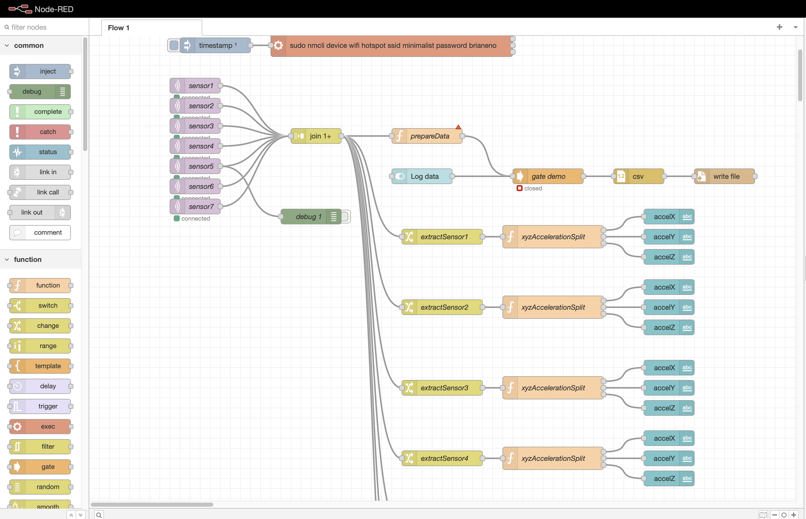

# Motivation
## Context
The mechanical team identified the need to measure acceleration levels on all three axis in different position of the vehicle
## Requirements
- 7 acceloremeters fitted on the bike
- data capture to be synchronized between all accelerometers
- minimum 10Hz acquisition bandwith
# Architecture
The architecture consists of an acquisition system responsible for logging the acceleration data into a csv file. The acquisition system (a RPi 4 model B) provides a wifi access point for all sensor nodes.

Each accelerometer sensor node consists of an MCU (ESP32) acquiring the acceleration data from a MPU6050 sensor over I2C. The MCU connects over wifi to the acquisition system's MQTT broker. The data is formatted and sent as payload on a topic dedicated to the sensor.

The sensors are numbered 1 to 7 and the MQTT topics are sensor1 to sensor7.

## Identification and operation of the sensor
When powered ON, the node's red LED switches ON. Each sensor features a blue which will first blink a number of times. This number **corresponds to the sensor number**.

After the initial blink sequence, the sensor will try and connect to the local WIFI network as well as initializing the sensor. When the operaiton is successful, **the blue LED remains permanently ON**.

The sensors have a bandwith of 21Hz (can be increased if needed).

## Access to the acquisition system

THe server can be accessed from a phone or computer connected to the same wifi network as the logger and sensors.

- ssid: minimalist
- passeord: brianeno

The address of the server is: http://10.42.0.1:1880/ui

The server feature 3 mains tabs accessible on the left hand side of the webpage:
- a data navigation to retrieve the log data
- a capture control, where logggin can be activated and the csv file defined
- a live view tab, where the live acceleration values of all 7 sensors are shown, for integration purposes

# Calibration

All sensors have been individually calibrated.

# Design and BOM

The enclosure for the sensors and acquisition system are 3d printed.
[Sensor Enclosure design](https://cad.onshape.com/documents/d1a062c2762928741100fa74/w/ccd835864bad5c1470baeb6b/e/06a54714a40f4e6c1a5da7e3).

The components used for the system are:

| Component | Description | Quantity | 
| --- | ----------- | -------- | 
| MCU | ESP32 DOIT Dev Kit 1 | 7 | 
| Central logger | RPI 4 B |1  |
| Accelerometers | MPU6050 | 7 | 
| USB cables | Micro USB cables 3meters | 7 | 
| USB power hub | USB power hub | 1 | 

